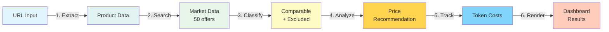
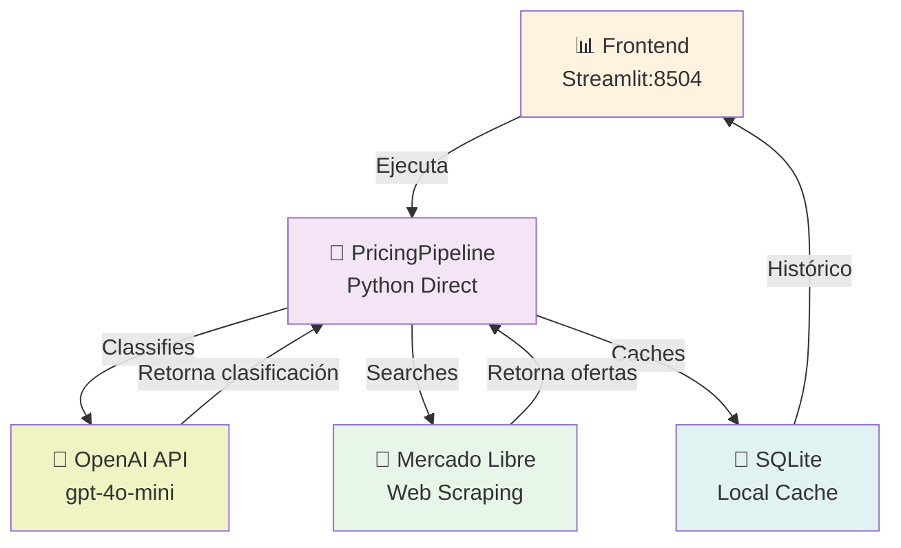

# Flujo Completo de Arquitectura - Louder Price Intelligence

## Resumen Ejecutivo

El pipeline completo tiene **9 STEPS** (ejecutados en orden secuencial):

0. **STEP 0**: Product Extractor - Extrae datos de tu producto (sin LLM)
1. **STEP 1**: Data Enricher (LLM) - Enriquece especificaciones
2. **STEP 2**: Search Strategy (LLM) - Determina búsquedas óptimas
3. **STEP 3**: Market Research - Scraping + múltiples queries (sin LLM)
4. **STEP 3b**: Price Validation - Valida tolerance range (sin LLM)
5. **STEP 4**: Product Matcher (LLM) - Clasifica comparables
6. **STEP 5**: Statistics - Calcula estadísticas (sin LLM)
7. **STEP 6**: Pricing Intelligence (LLM) - Genera recomendación
8. **STEP 7**: Commission Calculator - Desglose de ganancias reales (sin LLM)
9. **STEP 8**: Token Tracking - Captura uso API real (sin LLM)
10. **STEP 9**: Dashboard Render - Visualización final

---

## Diagrama Completo del Pipeline

```mermaid
graph TD
    START["🌐 INPUT: URL Producto<br/>Mercado Libre"]
    
    START -->|Usuario aporta| DASHBOARD["📊 DASHBOARD<br/>Streamlit Frontend"]
    
    DASHBOARD -->|cost_price + target_margin + price_tolerance| PIPELINE["🔄 PRICING PIPELINE<br/>Orquestador Central"]
    
    PIPELINE -->|STEP 0| EXTRACT["🔍 PRODUCT EXTRACTOR<br/>Sin LLM<br/>Tu producto"]
    EXTRACT -->|Title, Brand, Specs, Price, Images| PIVOT["📦 PIVOT PRODUCT<br/>Datos base"]
    
    PIVOT -->|STEP 1| ENRICH["💡 DATA ENRICHER<br/>LLM gpt-4o-mini"]
    ENRICH -->|enriched_specs, patterns| ENRICHED["🎯 ENRICHED DATA<br/>Category, key_specs<br/>market_segment"]
    
    ENRICHED -->|STEP 2| STRATEGY["🔎 SEARCH STRATEGY<br/>LLM gpt-4o-mini"]
    STRATEGY -->|primary + alternative queries| QUERIES["📋 SEARCH TERMS<br/>Primary search<br/>Alternative searches"]
    
    QUERIES -->|STEP 3| SCRAPE["🌍 MARKET RESEARCH<br/>Sin LLM - Scraping<br/>Múltiples búsquedas"]
    SCRAPE -->|50+ Ofertas| RAW["📦 RAW OFFERS<br/>Raw products"]
    
    RAW -->|STEP 3b| VALIDATE["📋 PRICE VALIDATION<br/>Sin LLM<br/>Filtra por tolerance"]
    VALIDATE -->|Filtra por rango| VALID["✅ VALIDATED OFFERS<br/>Solo en rango"]
    
    VALID -->|STEP 4| MATCHER["🧠 PRODUCT MATCHER<br/>LLM gpt-4o-mini<br/>Clasifica cada oferta"]
    
    MATCHER -->|LLM classification| RESULT["📊 CLASSIFICATION"]
    
    RESULT -->|is_comparable=true| PASS1["✔️ PASS 1<br/>Comparables SEGUROS"]
    RESULT -->|confidence < 0.7| UNCERTAIN["❓ UNCERTAIN<br/>Fallback candidates"]
    RESULT -->|is_comparable=false| EXCLUDED["❌ EXCLUDED<br/>Diferentes función, etc"]
    
    UNCERTAIN -->|PASS 2 Logic| PASS2["↔️ MERGE PASS 1 + PASS 2"]
    PASS2 -->|Final list| COMPARABLES["✅ FINAL COMPARABLES<br/>Merged results"]
    PASS1 -->|Already in| COMPARABLES
    
    COMPARABLES -->|STEP 5| CALC_STATS["📈 STATISTICS<br/>Sin LLM<br/>IQR, percentiles"]
    
    CALC_STATS -->|mean, median, IQR| STATS_OUT["📊 PRICE STATS<br/>Distribution analysis"]
    
    STATS_OUT -->|STEP 6| PRICING["💰 PRICING INTELLIGENCE<br/>LLM gpt-4o-mini<br/>Market analysis"]
    
    PRICING -->|Cost + margin analysis| REC["💵 RECOMMENDATION<br/>recommended_price<br/>margin_percent"]
    
    REC -->|STEP 7| PROFIT["🏦 COMMISSION CALCULATOR<br/>Sin LLM<br/>Real breakdown"]
    
    PROFIT -->|Shipping, Commission, Tax| PROFIT_OUT["💹 PROFITABILITY<br/>net_profit, roi%, margin%"]
    
    PROFIT_OUT -->|STEP 8| TOKENS["📈 TOKEN TRACKING<br/>Sin LLM<br/>Suma de agentes"]
    
    TOKENS -->|All response_metadata| TOKEN_OUT["🔑 TOKEN SUMMARY<br/>total_tokens, cost<br/>by_agent breakdown"]
    
    TOKEN_OUT -->|STEP 9| RENDER["🎨 DASHBOARD RENDER<br/>Streamlit<br/>Visualización"]
    
    RENDER -->|All results| FINAL["📊 COMPLETE RESULT<br/>Pivot product, Comparables<br/>Stats, Recommendation<br/>Profitability, Tokens"]
    
    FINAL -->|Usuario revisa| ACTION["✅ ACTION<br/>Aceptar, rechazar<br/>ajustar, iterar"]
    
    ACTION -->|Nuevo análisis| DASHBOARD
    
    style START fill:#e1f5ff
    style DASHBOARD fill:#fff3e0
    style PIPELINE fill:#f3e5f5
    style EXTRACT fill:#e8f5e9
    style PIVOT fill:#e0f2f1
    style ENRICH fill:#f0f4c3
    style ENRICHED fill:#fff9c4
    style STRATEGY fill:#ffe0b2
    style QUERIES fill:#ffccbc
    style SCRAPE fill:#f8bbd0
    style RAW fill:#c8e6c9
    style VALIDATE fill:#a5d6a7
    style VALID fill:#81c784
    style MATCHER fill:#c5cae9
    style RESULT fill:#b3e5fc
    style PASS1 fill:#81d4fa
    style UNCERTAIN fill:#fff9c4
    style EXCLUDED fill:#ffcdd2
    style PASS2 fill:#ffd54f
    style COMPARABLES fill:#fbc02d
    style CALC_STATS fill:#f9a825
    style STATS_OUT fill:#fb8c00
    style PRICING fill:#d84315
    style REC fill:#c62828
    style PROFIT fill:#7b1fa2
    style PROFIT_OUT fill:#5e35b1
    style TOKENS fill:#b3e5fc
    style TOKEN_OUT fill:#4fc3f7
    style RENDER fill:#29b6f6
    style FINAL fill:#039be5
    style ACTION fill:#0277bd
```



---

## Detalle de Cada Nodo

### 🌐 INPUT: URL Producto
```
Usuario proporciona:
- URL completa del producto en Mercado Libre
- Precio de costo (cost_price)
- Margen objetivo (target_margin %)
- Tolerancia de precio (price_tolerance)

Validaciones:
- URL formato válido Mercado Libre
- Valores numéricos válidos
```

### 📊 DASHBOARD (Frontend)
```
Streamlit Frontend que:
- Recibe input del usuario
- Muestra estado en tiempo real
- Visualiza resultados con gráficos
- Maneja errores gracefully
- Carga imágenes con fallback

Características:
- Error display con contexto del producto
- Token tracking visual (✅ REAL vs ⚠️ ESTIMADO)
- Tabla de comparables interactiva
- Historial de análisis
```

### 🔄 PRICING PIPELINE
```
Orquestador central que:
- Ejecuta todos los steps en secuencia
- Maneja tokens y costos
- Recolecta errores y logs
- Retorna estructura unificada

Outputs:
- pipeline_steps: dict con resultado de cada agente
- final_recommendation: precio + margen
- errors: lista de problemas
- token_usage: costos de API
```

### 🔍 PRODUCT EXTRACTOR
```
Extrae información del producto:
- Título y especificaciones
- Imágenes (URL principal + galería)
- Precio original y promociones
- Disponibilidad y stock
- Descripción detallada

Error Handling:
- Si image_url vacío → usa first image de lista
- Validación de spec completeness
- Fallback a valores por defecto

Output: Normalized Product Object
```

### 🔎 SEARCH STRATEGY
```
Determina la estrategia óptima de búsqueda:

ANÁLISIS DEL PRODUCTO:
- Extrae palabras clave principales (marca, modelo, specs)
- Identifica términos alternativos y sinónimos
- Prioriza specs más relevantes para búsqueda
- Detecta variantes de nombres en ML

GENERACIÓN DE QUERIES:
- Query principal: nombre completo + specs críticas
- Queries alternativas: con sinónimos, abreviaciones
- Pesos de relevancia para cada término
- Rango de precios sugerido

FILTROS OPTIMALES:
- Categoría más probable en ML
- Rango de precio (cost_price ± tolerance)
- Ordenamiento: precio o relevancia
- Límite de resultados: 50

EJEMPLO:
Input: "Detonador 8 chisperos Profesional"
Output: {
  "primary_query": "detonador 8 chisperos",
  "alternative_queries": [
    "detonador 8ch",
    "detonador profesional"
  ],
  "category_id": "MLM123456",
  "price_range": [400, 2000],
  "keywords_weight": {
    "detonador": 1.0,
    "8": 0.9,
    "chisperos": 0.8
  }
}

Output: Search Strategy Optimized
```

### 🌍 MARKET RESEARCH
```
Búsqueda en Mercado Libre usando estrategia optimizada:
- Query: resultado de SEARCH STRATEGY
- Filtros: categoría, rango de precio
- Límite: máximo 50 resultados
- Timeout: 30s con reintentos

Datos Capturados:
- Título, precio, seller
- Especificaciones normalizadas
- URL, imágenes
- Rating y número de ventas

Manejo de Errores:
- Sin resultados → lista vacía
- API timeout → reintentos exponenciales
- Rate limiting → queue + delay
```

### 🧠 PRODUCT MATCHER
```
Clasificación por LLM (gpt-4o-mini):

SISTEMA DE PROMPTS - CUSTOMER-CENTRIC:
"Find all products a CUSTOMER might consider"

Filosofía:
- ✅ "Buscas Detonador 8ch" → Considers Detonador 4ch
- ✅ "Buscas Bocina 18" → Considers Bocina 15  
- ✅ "Buscas Subwoofer 1000W" → Considers 800W
- ❌ "Buscas Bocina" → NO accesorios solos
- ❌ "Buscas Amplificador" → NO subwoofer

Reglas de Tolerancia:
- Tamaño: ±30% variación aceptable
- Potencia: ±40% variación aceptable
- Variantes de familia: COMPARABLE
- Color diferente: NO es razón para rechazar
```

### 🤖 Clasificación LLM
```
Output del modelo:
{
  "product": "título",
  "classification": "comparable" | "excluded",
  "confidence": 0.0-1.0,
  "reasoning": "explicación breve",
  "category": "tipo de producto",
  "spec_variance": "porcentaje diferencia"
}

Valores de Confidence:
- 0.9-1.0: Muy seguro
- 0.7-0.9: Seguro
- 0.5-0.7: Incierto (re-evaluación)
- <0.5: Probablemente erróneo
```

### ✔️ COMPARABLE PRODUCTS
```
Productos que pasan filtros:
- Clasificados como "comparable" por LLM
- Confidence > 0.7 O uncertain con pass 2
- Especificaciones dentro de tolerancia
- Mismo segmento/categoría del producto base

Datos Incluidos:
- Título y especificaciones
- Precio y seller
- URL y imágenes
- Razonamiento de clasificación
- Score de similitud
```

### ❌ EXCLUDED PRODUCTS
```
Rechazados por razones claras:
- Función diferente (no es comparable)
- Solo accesorios (sin producto base)
- Producto dañado o defectuoso
- Categoría completamente diferente
- Specs fuera de rango de tolerancia

Razones Registradas:
- Específica para cada exclusión
- Useful para auditar decisiones
- Mostrado en dashboard
```

### ❓ UNCERTAINTY FILTER
```
Re-evaluación de inciertos:
- Triggered cuando: confidence < 0.7
- Contexto: "¿Debería incluir aunque sea incierto?"
- Criterio: Si missing 1-2 specs pero categoría igual
- Decision: Incluir o descartar

Two-Pass Strategy:
PASS 1: Strict (only is_comparable=true)
PASS 2: Uncertain (is_comparable=false AND conf<0.7)
RESULT: Merge ambos pases
```

### 💰 PRICING ANALYSIS
```
Análisis de precios competitivos:

Calcula:
- Promedio de precios de comparables
- Mediana (menos sensible a outliers)
- Rango de precios (min-max)
- Desviación estándar
- Percentiles (25%, 75%)

Formula de Recomendación:
- Base: Cost_Price
- Markup: Margen objetivo
- Ajuste: Competitividad (median comparable)
- Output: Precio sugerido + rango

Competitividad:
- SI sugerido > median comparable = ⚠️ alto
- SI sugerido < min comparable = ✅ muy competitive
- SI sugerido = median = 📊 market neutral
```

### 🔑 TOKEN TRACKING
```
Captura tokens de CADA llamada LLM:

Sources de Tokens:
1. Product Extractor: Web parsing
2. Market Research: Search query
3. Product Matcher: Classification (PRINCIPAL)
4. Pricing Analysis: Decision logic

Estructura Capturada:
{
  "prompt_tokens": número,
  "completion_tokens": número,
  "total_tokens": número,
  "model": "gpt-4o-mini",
  "timestamp": "2026-01-23T..."
}

Costos Calculados:
- Prompt: $0.00015 por token
- Completion: $0.0006 por token
- Total costo real: suma de todas las llamadas
```

### 💵 RECOMENDACIÓN FINAL
```
Output Consolidado:
{
  "pivot_product": {
    "title": "...",
    "price": número,
    "specs": {...}
  },
  "comparable_offers": [...],
  "excluded_offers": [...],
  "pricing_recommendation": {
    "suggested_price": número,
    "margin_percentage": número,
    "price_range": {
      "min": número,
      "max": número
    },
    "competitiveness": "string"
  },
  "cost_analysis": {
    "real_tokens": número,
    "real_cost": número,
    "comparables_found": número
  }
}
```

### 🎨 DASHBOARD RENDER
```
Presentación Visual:
1. Información del Producto
   - Título, especificaciones
   - Imagen (con fallback logic)
   - Precio original y URL

2. Tabla de Comparables
   - Colummnas: Título, Specs, Precio, Seller
   - Sortable, filterable
   - Links a productos

3. Análisis de Precios
   - Gráfico de distribución
   - Precio sugerido highlighted
   - Margen % recomendado

4. API Costs Display
   - ✅ REALES: Tokens capturados
   - Desglose por agente
   - Costo total

5. Error Handling
   - Muestra error message
   - Pero mantiene info del producto
   - Suggiere acciones correctivas
```

### ✅ DECISIÓN USUARIO
```
Acciones Disponibles:
1. Aceptar recomendación
2. Ajustar parámetros
   - cost_price
   - target_margin
   - price_tolerance
   - max_offers
3. Nuevo análisis
4. Exportar resultados

Feedback Loop:
- Usuario puede iterar
- Cada iteración usa tokens
- Historial se mantiene
- Comparativa acumulada
```

---

## Flujo de Datos Global



---

## Consideraciones Clave en Cada Nodo

| Nodo | Consideración Principal | Error Crítico | Fallback |
|------|-------------------------|--------------|----------|
| **Extractor** | Completitud de specs | Specs incompletos | Valores por defecto |
| **Search Strategy** | Relevancia de keywords | Query vacía o genérica | Query por nombre + modelo |
| **Search** | Relevancia de resultados | Timeout / No results | Reintentos, lista vacía |
| **Matcher** | Balance strict/flexible | Too strict rejection | Two-pass con uncertain |
| **Pricing** | Outliers en precios | No comparables válidos | Precio base + margen |
| **Tokens** | Captura en tiempo real | Key mismatch | Token defaults |
| **Dashboard** | UX con errores | Crash on error | Show product + error msg |

---

## Decisiones de Diseño

✅ **Customer-Centric Matching**
- No rechazamos por specs exactos
- Aceptamos variantes si son comparables

✅ **Two-Pass Filtering**
- Primero: Ultra-strict (confidence > 0.9)
- Segundo: Fallback (confidence 0.5-0.9)

✅ **Real Token Tracking**
- Captura `response_metadata['token_usage']`
- Mostrada en dashboard con ✅ indicator

✅ **Error Resilience**
- Mostrar producto incluso con errores
- Error message + product context

✅ **Image Fallback**
- Si `image_url` vacío → primer imagen de lista
- Garantiza visualización

---

## Endpoints y Conexiones



---

## Validaciones en Cada Paso

```
1️⃣ INPUT VALIDATION
   ✓ URL format válido
   ✓ Números positivos (cost_price, margin)
   ✓ Rango válido (price_tolerance 0-1)

2️⃣ EXTRACTION VALIDATION
   ✓ Specs no vacías
   ✓ Precio > 0
   ✓ Al menos 1 imagen

3️⃣ SEARCH VALIDATION
   ✓ Al menos 5 resultados
   ✓ Specs normalizadas
   ✓ URLs válidas

4️⃣ CLASSIFICATION VALIDATION
   ✓ JSON válido del LLM
   ✓ Confidence 0-1
   ✓ Classification en ['comparable', 'excluded']

5️⃣ PRICING VALIDATION
   ✓ Al menos 3 comparables
   ✓ Precio sugerido > cost_price
   ✓ Margen % positivo

6️⃣ TOKEN VALIDATION
   ✓ Tokens > 0
   ✓ Cost > 0
   ✓ Timestamp válido
```

---

**Versión:** v1.0  
**Fecha:** 23 Enero 2026  
**Estado:** Implementado y validado ✅
